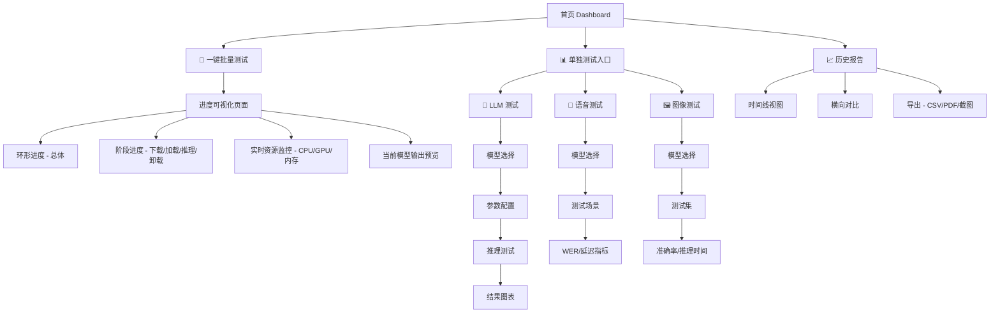

# Benchmark UX 调研报告

## 概述

本报告调研了主流本地模型基准测试工具的 UI/UX 设计，旨在为 hiringai-ml-kit 的基准测试功能提供优化建议，使其成长为 Android 平台最佳的模型基准测试工具。

---

## 一、主流工具调研分析

### 1.1 LM Studio (桌面端标杆)

**核心 UI 特点：**

| 特性 | 描述 | 借鉴价值 |
|------|------|----------|
| VRAM 实时监控 | 图形化显示 GPU 内存占用，动态更新 | ⭐⭐⭐⭐⭐ |
| 参数可视化调整 | 滑块 + 下拉菜单配置，无需编辑配置文件 | ⭐⭐⭐⭐⭐ |
| 模型发现内嵌浏览器 | 搜索、下载进度条、状态指示一体化 | ⭐⭐⭐⭐ |
| 内置 Chat Playground | 测试与管理一体化，即时反馈 | ⭐⭐⭐⭐ |
| 系统监控面板 | CPU/GPU/内存实时状态 | ⭐⭐⭐⭐⭐ |

**交互流程：**
```
首页 → 模型列表 → 参数可视化调整 → 实时推理测试 → 资源监控
```

### 1.2 Ollama 新 UI (2025)

**核心 UI 特点：**

| 特性 | 描述 | 借鉴价值 |
|------|------|----------|
| 极简聊天界面 | 对话式交互，零学习成本 | ⭐⭐⭐⭐⭐ |
| 模型状态指示 | 未下载显示下载按钮，下载中显示进度 | ⭐⭐⭐⭐ |
| 侧边栏历史记录 | 多会话管理，快速切换 | ⭐⭐⭐⭐ |
| 拖拽多模态输入 | 图像/文件即拖即用 | ⭐⭐⭐ |

### 1.3 AIBench (移动端)

**核心 UI 特点：**

| 特性 | 描述 | 借鉴价值 |
|------|------|----------|
| 专业性能分析 | 实时监控推理速度、GPU 指标、内存状态 | ⭐⭐⭐⭐⭐ |
| 测试场景丰富 | 内置多种测试用例 | ⭐⭐⭐⭐ |
| 结果可视化 | 图表展示性能数据 | ⭐⭐⭐⭐ |

### 1.4 学术基准测试框架

| 框架 | 核心贡献 | 借鉴价值 |
|------|----------|----------|
| A3 (Android Agent Arena) | 任务分类、三级难度、系统状态评估 | 测试场景设计 |
| Mobile-Env | 隔离环境、中间奖励机制 | 测试环境管理 |
| VenusBench-Mobile | 用户意图驱动、细粒度诊断 | 评估指标设计 |

---

## 二、当前 hiringai-ml-kit 能力评估

### 2.1 现有功能评分

| 模块 | 当前状态 | 评分 | 改进方向 |
|------|----------|------|----------|
| LLM 基准测试 | 支持下载→加载→推理→卸载全流程 | ⭐⭐⭐⭐ | 增强可视化 |
| 语音/图像测试 | 基础测试支持 | ⭐⭐⭐ | 扩展测试场景 |
| UI 界面 | Card 布局，功能分区清晰 | ⭐⭐⭐ | 视觉升级 |
| 报告导出 | 文本摘要 + CSV | ⭐⭐⭐ | 图表化展示 |
| 数据可视化 | 仅 ProgressBar | ⭐⭐ | 图表组件集成 |

### 2.2 架构优势

- **Bridge 模式**：ML 与业务解耦，便于独立演进
- **子模块独立**：可单独编译、测试、发布
- **Flow 进度跟踪**：支持实时进度更新

---

## 三、UX 设计原则 (行业标准)

### 3.1 信息层级结构

```
顶部 (一眼可扫): 系统健康、最近变化、主要风险、SLA指标
中部 (10秒可读): 驱动因素、分段明细
底部 (2分钟深挖): 诊断证据、日志、Trace
```

### 3.2 卡片设计模式

```
卡片 = 标题 + 时间窗口 + 数值 + 变化量 + 置信提示 + 下钻入口
```

### 3.3 时间/新鲜度/上下文

每张图表应显示：
- 时间范围 (last 24h, 7d, 30d)
- 最后更新时间
- 数据来源 (batch, streaming, manual)
- 时区和聚合级别

---

## 四、优化方案

### 4.1 UI 视觉升级

| 改进点 | 当前实现 | 推荐方案 |
|--------|----------|----------|
| 进度展示 | ProgressBar | 环形进度 + 阶段分解动画 |
| 数据可视化 | 纯文本 | 柱状图 / 折线图 / 雷达图 |
| 模型状态 | TextView | 状态芯片 + 图标 + 下载进度 |
| 报告展示 | ScrollView | 可视化图表 + 可展开详情 |

### 4.2 优化后的用户流程图



### 4.3 推荐的 Figma 设计资源

1. **Dashboard UI Kit** - Figma Community Dashboard Templates
2. **AI/ML Metrics Dashboard** - 专门的数据可视化组件
3. **Benchmark 卡片组件** - 预制的进度卡片、指标展示组件

---

## 五、核心竞争力强化路线图

| 优先级 | 功能 | 描述 | 时间预估 |
|--------|------|------|----------|
| P0 | 多模型对比视图 | 横向对比表格 + 雷达图 | 2 周 |
| P0 | 实时资源监控 | CPU/GPU/内存图表 | 1 周 |
| P1 | 设备适配建议 | 根据机型推荐最佳模型 | 1 周 |
| P1 | 测试场景标准化 | 内置标准数据集 | 2 周 |
| P2 | 结果可信度指标 | 多次测试方差、异常值标记 | 1.5 周 |
| P2 | 社区分享 | 导出分享报告 / 机型性能排行 | 2 周 |

---

## 六、技术实现建议

### 6.1 图表库选择

| 库 | 优点 | 适用场景 |
|----|------|----------|
| MPAndroidChart | 功能全面，文档丰富 | 折线图、柱状图、雷达图 |
| Vico | 现代化 API，性能优 | 轻量图表展示 |
| AnyChart | 交互性强 | 复杂可视化 |

推荐：MPAndroidChart（项目已集成）

### 6.2 状态管理

```kotlin
// 推荐的状态模式
sealed class BenchmarkState {
    object Idle : BenchmarkState()
    data class Running(val progress: DetailedBenchmarkProgress) : BenchmarkState()
    data class Completed(val report: BatchBenchmarkReport) : BenchmarkState()
    data class Error(val message: String) : BenchmarkState()
}
```

### 6.3 组件化建议

| 组件 | 职责 |
|------|------|
| ProgressRingView | 环形进度指示器 |
| ResourceMonitorView | CPU/GPU/内存实时监控 |
| ModelStatusChip | 模型状态显示 |
| BenchmarkResultChart | 结果图表展示 |
| ReportExportDialog | 报告导出弹窗 |

---

## 七、总结

**已有基础**：hiringai-ml-kit 具备良好的架构基础，核心功能完整。

**核心差距**：
1. UI 视觉缺乏数据可视化组件
2. 信息层级需要更清晰的分层设计
3. 交互流畅度需要提升

**下一步建议**：
1. 使用 Figma 制作 Dashboard UI Mockup
2. 集成 MPAndroidChart 实现图表化报告
3. 实现实时资源监控功能

---

## 附录：参考资料

1. LM Studio - https://lmstudio.ai/
2. Ollama - https://ollama.com/
3. A3: Android Agent Arena - https://arxiv.org/abs/2501.01149
4. VenusBench-Mobile - https://arxiv.org/abs/2604.06182
5. Dashboard UI Best Practices - https://refero.design/p/dashboard-ui-best-practices/
6. AI/ML Data Visualization UX - https://thefinch.design/ux-best-practices-ai-ml-data-visualization-dashboards/
